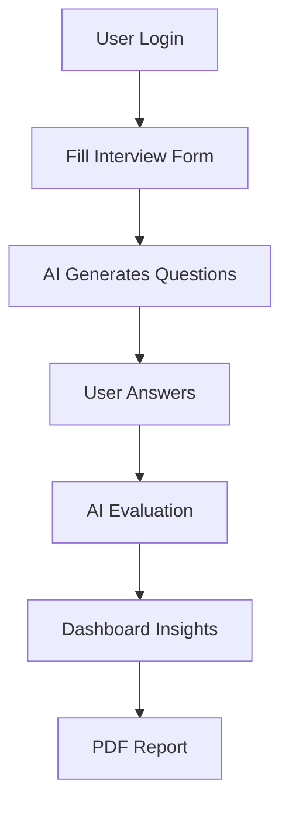

# 🚀 MentR2B – AI Career Mentor & Mock Interview Platform  

<p align="center">
  
</p>

<p align="center">
  <a href="https://mentr2b.vercel.app/"></a>
  
  
  
</p>

---

## 🧠 About the Project  

✨ **MentR2B** is an AI-powered platform that simulates real interview experiences.  
It helps users prepare smarter with **AI-generated questions, instant feedback, and performance tracking**.

> 💡 Built to bridge the gap between **learning and real-world interviews**

---


## 🔥 Features  

- 🤖 AI-generated interview questions  
- 🎯 Personalized experience based on skills  
- 📊 Real-time evaluation & scoring  
- 📈 Dashboard with analytics  
- 🔐 Secure authentication (Clerk)  
- 📄 Downloadable PDF reports  
- 🌐 Industry insights  

---

## 🏗️ Tech Stack  

<p align="center">


</p>

---

## ⚙️ Workflow  



---

## 📂 Project Structure  

```
MentR2B/
├── app/               # Next.js app router
├── components/       # UI components
├── actions/          # Backend logic
├── lib/              # Utilities
├── prisma/           # Database schema
├── public/           # Static assets
└── styles/           # Styling
```
## 🚀 Getting Started  

### 1️⃣ Clone the Repository  
```bash
git clone https://github.com/your-username/mentr2b.git
cd mentr2b
```

### 2️⃣ Install Dependencies  
```bash
npm install
```

### 3️⃣ Setup Environment Variables  

Create a `.env` file in the root directory and add:

```env
DATABASE_URL=
NEXT_PUBLIC_CLERK_PUBLISHABLE_KEY=
CLERK_SECRET_KEY=
GEMINI_API_KEY=
```

### 4️⃣ Run the Project Locally  
```bash
npm run dev
```

---

## 📊 Key Highlights  

- ✨ AI-powered personalized learning  
- ⚡ Fast & scalable architecture  
- 📈 Real-time analytics  
- 🌍 Accessible anytime, anywhere  

---

## ⚠️ Limitations  

- ⚠️ AI responses may vary  
- 🌐 Requires internet connection  
- 🤖 No real human interaction  

---

## 🔮 Future Scope  

- 🎤 Voice-based interview system  
- 🎥 Video interview analysis  
- 📄 Resume evaluation feature  
- 📱 Mobile application  

---

## 🤝 Contributing  

We welcome contributions! Follow these steps:

```bash
Fork → Clone → Create Branch → Commit → Push → Pull Request
```

---
